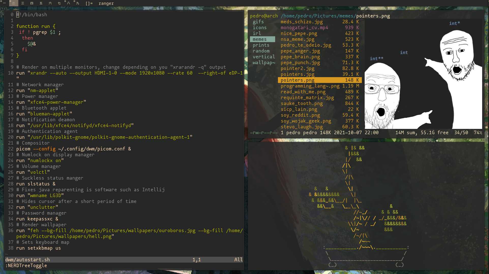
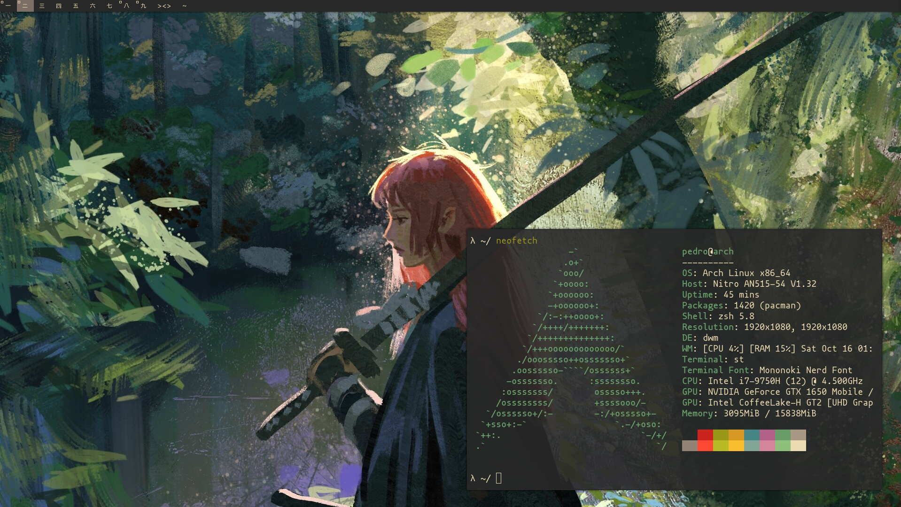

# DWM dotfiles
## Welcome to my personal build of dwm

## The objective

This is a heavily patched version of the suckless dynamic window manager from the suckless team. It is intended to be a complete replacement for a desktop environment.

This repository exists mainly for my personal interest in being able to easily bootstrap a system when needed, but I figured others might want to use it as well.

Note that I use this WM in arch linux, but any distro with the necessary packages will be able to run it.

## Dependencies

- xrandr for multiple monitor setups

- nm-applet for managing networks

- xfce4-power-manager as the power manager

- blueman for bluetooth connections

- xfce4-notifyd for notifications

- polkit for managing authentications

- picom as the compositor

- numlockx for getting the numeric keyboard working at the display manager

- volctl to manage volume

- unclutter to hide the cursor when it is not in use

- keepassxc as the password manager

- feh for background rendering

- xkbpmap to set the keyboard layout 

- my (included) build of slstatus 

## Patches

- dwm-alphasystray
- dwm-autostart
- dwm-alwayscenter
- dwm-center
- dwm-r1615-selfstart
- dwm-cyclelayouts
- dwm-shiftview
- dwm-fullgaps
- dwm-viewontag
- dwm-wrap-6.2
- dwm-pertag-20200914-61bb8b2

## Installation

If you want to use this config it is theoretically enough to: 

```
git clone https://github.com/pedro-git-projects/pedro-dwm

cd pedro-dwm

cd dwm 

sudo make clean install

cd ..

cd slstatus 

sudo make clean install
```
However don't expect this to simply work. There are two catches:

1. The dependecies you just saw listed: without them you can expect some functionality to fail.

2. My autostart.sh : the way I patched dwm, it searches for the script at ~/.config/dwm this means you should cp my directory to you .config folder, else auto start won't work

Beyond that, make sure to either download the JoyPixels font or change the **static const char *fonts[]** variable at my **config.h**. 

Less essential but important as well is making sure you change the value attributed to the variables *filecmd, *termcd, *browser, *music, and  *code ant the **config.h** to your preferred applications before using my build.

## Screenshots





## To do

Shell script  install all dependencies on arch-based systems automatically.  
